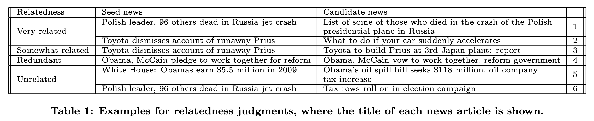

# About

Articles Recommender for [Articles sharing and reading from CI&T DeskDrop](https://www.kaggle.com/gspmoreira/articles-sharing-reading-from-cit-deskdrop)

# Fetch Data

Download data and place in `data/` directory 
* [shared_articles.csv](https://www.kaggle.com/gspmoreira/articles-sharing-reading-from-cit-deskdrop/downloads/shared_articles.csv/5)
* [users_interactions.csv](https://www.kaggle.com/gspmoreira/articles-sharing-reading-from-cit-deskdrop/downloads/users_interactions.csv/5)

# Notebooks for Analysis of Data
* [Exploratory Data Analysis of User_Interactions](notebooks/EDA_User_Interactions.ipynb)
* [Exploratory Data Analysis of Articles_Shared](notebooks/EDA_Articles_Shared.ipynb)
* [Exploring Topic Modelling on Articles_Shared](notebooks/Topic_Modelling_on_Shared_Articles.ipynb)

# 

# Generate Train and Test Datasets for different Time Periods

Use [Prepare_Data.ipynb](notebooks/Prepare_Data.ipynb) in `notebooks/` to generate train and test datasets for various time periods

```
ls -lR train_test_datasets/
train_test_datasets/:
total 16
drwxr-xr-x 2 ravi ravi 4096 Aug 12 21:06 dataset_1
drwxr-xr-x 2 ravi ravi 4096 Aug 12 21:06 dataset_2
drwxr-xr-x 2 ravi ravi 4096 Aug 12 21:06 dataset_3
drwxr-xr-x 2 ravi ravi 4096 Aug 12 21:06 dataset_4

train_test_datasets/dataset_1:
total 524
-rw-r--r-- 1 ravi ravi 508568 Aug 12 21:06 test_2016Q2.csv
-rw-r--r-- 1 ravi ravi  22554 Aug 12 21:06 train_2016Q1.csv

train_test_datasets/dataset_2:
total 888
-rw-r--r-- 1 ravi ravi 376792 Aug 12 21:06 test_2016Q3.csv
-rw-r--r-- 1 ravi ravi 529674 Aug 12 21:06 train_2016Q1_2016Q2.csv

train_test_datasets/dataset_3:
total 1076
-rw-r--r-- 1 ravi ravi 200270 Aug 12 21:06 test_2016Q4.csv
-rw-r--r-- 1 ravi ravi 900120 Aug 12 21:06 train_2016Q1_2016Q2_2016Q3.csv

train_test_datasets/dataset_4:
total 1176
-rw-r--r-- 1 ravi ravi  102952 Aug 12 21:06 test_2017Q1.csv
-rw-r--r-- 1 ravi ravi 1093990 Aug 12 21:06 train_2016Q1_2016Q2_2016Q3_2016Q4.csv
```

# Run Train, Eval and Recommendation for each DataSet
1. Create the following directories to store models produced from each dataset
    ```
    mkdir models_datasets
    mkdir models_datasets/dataset_1
    mkdir models_datasets/dataset_2
    mkdir models_datasets/dataset_3
    mkdir models_datasets/dataset_4
    ```
2. Move generated model and evaluation results in `models/` into 'models_datasets/dataset_1, models_datasets/dataset_2...'
    ```
    python rec_random_based.py train_test_datasets/dataset_1/train_2016Q1.csv train_test_datasets/dataset_1/test_2016Q2.csv --meta_data data/shared_articles.csv
    python rec_popularity_based.py train_test_datasets/dataset_1/train_2016Q1.csv train_test_datasets/dataset_1/test_2016Q2.csv --meta_data data/shared_articles.csv
    python rec_user_based_cf.py train_test_datasets/dataset_1/train_2016Q1.csv train_test_datasets/dataset_1/test_2016Q2.csv --meta_data data/shared_articles.csv
    python rec_item_based_cf.py train_test_datasets/dataset_1/train_2016Q1.csv train_test_datasets/dataset_1/test_2016Q2.csv --meta_data data/shared_articles.csv
    python rec_content_based.py train_test_datasets/dataset_1/train_2016Q1.csv train_test_datasets/dataset_1/test_2016Q2.csv data/shared_articles.csv

    mv models models_datasets/dataset_1/

    python rec_random_based.py train_test_datasets/dataset_2/train_2016Q1_2016Q2.csv train_test_datasets/dataset_2/test_2016Q3.csv --meta_data data/shared_articles.csv
    python rec_popularity_based.py train_test_datasets/dataset_2/train_2016Q1_2016Q2.csv train_test_datasets/dataset_2/test_2016Q3.csv --meta_data data/shared_articles.csv
    python rec_user_based_cf.py train_test_datasets/dataset_2/train_2016Q1_2016Q2.csv train_test_datasets/dataset_2/test_2016Q3.csv --meta_data data/shared_articles.csv
    python rec_item_based_cf.py train_test_datasets/dataset_2/train_2016Q1_2016Q2.csv train_test_datasets/dataset_2/test_2016Q3.csv --meta_data data/shared_articles.csv
    python rec_content_based.py train_test_datasets/dataset_2/train_2016Q1_2016Q2.csv train_test_datasets/dataset_2/test_2016Q3.csv data/shared_articles.csv

    mv models models_datasets/dataset_2/

    python rec_random_based.py train_test_datasets/dataset_3/train_2016Q1_2016Q2_2016Q3.csv train_test_datasets/dataset_3/test_2016Q4.csv --meta_data data/shared_articles.csv
    python rec_popularity_based.py train_test_datasets/dataset_3/train_2016Q1_2016Q2_2016Q3.csv train_test_datasets/dataset_3/test_2016Q4.csv --meta_data data/shared_articles.csv
    python rec_user_based_cf.py train_test_datasets/dataset_3/train_2016Q1_2016Q2_2016Q3.csv train_test_datasets/dataset_3/test_2016Q4.csv --meta_data data/shared_articles.csv
    python rec_item_based_cf.py train_test_datasets/dataset_3/train_2016Q1_2016Q2_2016Q3.csv train_test_datasets/dataset_3/test_2016Q4.csv --meta_data data/shared_articles.csv
    python rec_content_based.py train_test_datasets/dataset_3/train_2016Q1_2016Q2_2016Q3.csv train_test_datasets/dataset_3/test_2016Q4.csv data/shared_articles.csv

    mv models models_datasets/dataset_3/

    python rec_random_based.py train_test_datasets/dataset_4/train_2016Q1_2016Q2_2016Q3_2016Q4.csv train_test_datasets/dataset_4/test_2017Q1.csv --meta_data data/shared_articles.csv
    python rec_popularity_based.py train_test_datasets/dataset_4/train_2016Q1_2016Q2_2016Q3_2016Q4.csv train_test_datasets/dataset_4/test_2017Q1.csv --meta_data data/shared_articles.csv
    python rec_user_based_cf.py train_test_datasets/dataset_4/train_2016Q1_2016Q2_2016Q3_2016Q4.csv train_test_datasets/dataset_4/test_2017Q1.csv --meta_data data/shared_articles.csv
    python rec_item_based_cf.py train_test_datasets/dataset_4/train_2016Q1_2016Q2_2016Q3_2016Q4.csv train_test_datasets/dataset_4/test_2017Q1.csv --meta_data data/shared_articles.csv
    python rec_content_based.py train_test_datasets/dataset_4/train_2016Q1_2016Q2_2016Q3_2016Q4.csv train_test_datasets/dataset_4/test_2017Q1.csv data/shared_articles.csv

    mv models models_datasets/dataset_4/
    ```

# Compare Evaluation Results
* [Compare Models with various evaluation metrics](notebooks/Analyse_Evaluation.ipynb)

# Individual APIs to experiment with train, evaluate and recommend

    python rec_user_based_cf.py train_test_datasets/dataset_4/train_2016Q1_2016Q2_2016Q3_2016Q4.csv train_test_datasets/dataset_4/test_2017Q1.csv --meta_data data/shared_articles.csv --train
    python rec_user_based_cf.py train_test_datasets/dataset_4/train_2016Q1_2016Q2_2016Q3_2016Q4.csv train_test_datasets/dataset_4/test_2017Q1.csv --meta_data data/shared_articles.csv --eval
    python rec_user_based_cf.py train_test_datasets/dataset_4/train_2016Q1_2016Q2_2016Q3_2016Q4.csv train_test_datasets/dataset_4/test_2017Q1.csv --meta_data data/shared_articles.csv --recommend --user_id 5974049584912996673

    python rec_item_based_cf.py train_test_datasets/dataset_4/train_2016Q1_2016Q2_2016Q3_2016Q4.csv train_test_datasets/dataset_4/test_2017Q1.csv --meta_data data/shared_articles.csv --train
    python rec_item_based_cf.py train_test_datasets/dataset_4/train_2016Q1_2016Q2_2016Q3_2016Q4.csv train_test_datasets/dataset_4/test_2017Q1.csv --meta_data data/shared_articles.csv --eval
    python rec_item_based_cf.py train_test_datasets/dataset_4/train_2016Q1_2016Q2_2016Q3_2016Q4.csv train_test_datasets/dataset_4/test_2017Q1.csv --meta_data data/shared_articles.csv --recommend --user_id 6756039155228175109

# Next Steps

* Setup Rating Based Recommender leveraging `preference` value of each user, item as `ratings`, to consider user events such as VIEW, LIKE, COMMENT, BOOKMARK, SHARE

* Model Transition Smoothness using cosine similarity bw context vectors as defined in [Learning to Model Relatedness for News Recommendation](https://www.dropbox.com/s/ctgqgve28kz6xzl/Paper_Learning%20to%20Model%20Relatedness%20for%20News%20Recommendation.pdf?dl=0)
- Web services such as Yahoo! and Digg attract users’ initial clicks by leveraging various kinds of signals, how to engage such users algorithmically after their initial visit is largely under explored. In this paper, we study the problem of post-click news recom- mendation. 
- Given that a user has perused a current news article, our idea is to automatically identify “related” news articles which the user would like to read afterwards. Specif- ically, we propose to characterize **relatedness between news articles across four aspects: relevance, novelty, connection clarity, and transition smoothness.** Motivated by this un- derstanding, we define a set of features to capture each of these aspects and put forward a learning approach to model relatedness.
- One important advantage of online news over traditional newspapers is that the former can be augmented with hy- perlinks to other related news. When a user has clicked and is reading a current article, he/she may also feel interested in related articles that logically flow from the content of the current page. We thus name it post-click news recommenda- tion, with the goal of potentially promoting users’ navigation on the visited website.
    - However, on the other hand, if the recommended articles are not logically related to the current news, it would probably not only fail to capture user interest, but also often hurt the user’s overall satisfaction.
    - In the state of the art, post-click news recommendation is typically done by editors’ manual effort of searching through a corpus of news documents. The process is not only ex- pensive and cumbersome, but may also be limited by the editors’ familiarity with the news topics.
- What makes a news article related to the current news article?
    - 
    - Presumably, two news articles should be **contextually** similar to each other. In this sense, **similarity/relevance** would be an important signal of relatedness. This factor can be captured through standard information retrieval models
    -  it would be encouraged that only a fraction of content is shared across the articles, while other parts are mostly about novel news-worthy topics. Nonetheless, IR models usually favor documents that are very similar to the current news (e.g., example 4), yet such documents are not really related to the need of users given that they have already read the current news article. Thus, **novelty**, a somewhat contrary notion to similarity/relevance, should also be a signal of relatedness.
    - to explicitly capture another key dimension of relatedness, **coherence**, using two novel concepts
        - First, there should be a clear connection between two documents to maintain topical continuity. In other words, the overlap between two documents should be comprised of some meaningful topical context. However, word overlap that is able to capture relevance and novelty may not always capture topical continuity
            - For the example 5, the overlap of words like “Obama, million, dollar, · · · ” are not discriminative enough to represent a specific topic. As a consequence, the two articles are not connected well.
            - To capture this heuristic, we propose a new signal, **connection clarity,** by estimating the entropy of the language usage behind an overlap so as to measure the uncertainty of topics shared by two documents.
        - Second, the stories in two articles should also be of continuity of senses so that a user’s reading interests could tran- sit from one to the other smoothly.
            - For example, generally speaking, it would be more smooth to transit from news “Toyota dismisses account of runaway Prius” to “What to do if your car suddenly accelerates” than to “Toyota to build Prius at 3rd Japan plant”, although both candidate articles satisfy all the three properties above (i.e., relevance, novelty, and connection clarity)
            - We thus propose the fourth signal **transition smoothness** which measures the likelihood that the two stories can be combined into a single article in a natural way. The intuition is that, if human editors would like to put two stories together under some context, it may mean that the two stories are in a smooth transition, at least from editors’ perspective.
- a unified relatedness function to leverage the complementary relative strengths of various heuristics, by employing a state-of-the-art learning to rank framework, GBRank, that combines various relatedness features and learns a unified relatedness function.

- PROBLEM FORMULATION
    - Seed News: A news article s from the news corpus C that is clicked and being read by a user.
    - A candidate news article (or candidate for short) d, is one of news articles from the news corpus C that are recommended to the user after he/she has clicked to read seed s.
    - The relatedness function f is used to estimate the relatedness score of a candidate d given a seed article s, i.e., f (s, d). It denotes how well the candidate news is related to the seed news. Given that d1 and d2 are both candidate news articles, d1 is a better article to recommend than d2 if f(s, d1) > f(s, d2).
        - For a recommender system, if the click-rates of different candidate news are known, one could use them directly as the relatedness scores. However, such methods rely heavily on historical data, and thus face a cold-start problem if the seed news is new; moreover, the method would also be biased against selecting a newly-published article as related news if it has not been clicked before.
        - Considering these limitations, in our work, we choose to initially focus on **content-based news recommendation, in which recommendations are based on the relatedness of news content.**
    - Given a seed article s, the problem of post-click news recommendation is to (1) identify a set of candidate articles D = {d1, · · · , dm}, and (2) design a relatedness function to score each candidate as f(s,di). With D and f, we can then select a ranked list of n (n < m) candidates with the highest relatedness scores Ds = {ds,1 , · · · , ds,n } for s.
    - two stage approach proposed in to first use a standard information retrieval model to retrieve a set of documents by taking the seed article as a query, and then remove relatively obvious redundant articles.

- MODELING RELATEDNESS
    - Relevance and Novelty
        - contextual similarity/relevance
            - Intuitively, a related document should at least share some similar content with the seed document. For example, the two news articles in example 6 of Table 1 are too dissimilar to each other, and clearly they are not related.
        - novelty
            - On the other hand, if two news articles are too similar to each other, it is clear that users may not be interested in one given that they already read the other, since there may be no novel information in the other article. For example, we do not want to recommend one of the two very similar articles in example 4 of Table 1 as a related news article to the other

        - For a related document, it would be encouraged that only a portion shares similar content with the seed article, while other parts are mostly about some novel topics. We thus investigate passage retrieval, which computes the relevance score for a document mainly based on the best matching passage.

        - Both relevance and novelty signals can only model the word overlap between two articles s and d; they essentially measure the size of overlap, i.e. |s∩d|
    - Connection Clarity
        - However, it is often observed that pure word overlap between two news articles does not necessarily indicate relatedness. We illustrate this with the following example:
        s: White House: Obamas earn $5.5 million in 2009
        d: Obama’s oil spill bill seeks $118 million, oil company
        - The two articles s and d share the same words like “Obama, million, dollar, ...”, and there is also novel information contained in the candidate d, but they turn out to be unrelated.
        - Intuitively, in order to make two documents related, they should **share a clear story/thread** to make them topically cohesive. This can often be achieved by repeating the same topic or similar topic, which forms topical links that connect two documents together and make them related.
        - Arguably the clearer the topical connection is, the more related the two documents would probably be.
        - The relative entropy as the connection clarity score, essentially measures the language usage associated with s ∩ d as compared to the background language model of the collection as a whole.
    - Transition Smoothness
        - Even if a candidate article satisfies all the above proper- ties, would a user like to transit to this article after reading the current news?
        -  Let’s take a look at some examples:
            s : Toyota dismisses account of runaway Prius
            d1: What to do if your car suddenly accelerates
            d2: Toyota to build Prius at 3rd Japan plant: report
            Given a seed (s), we believe that users would be more likely to read candidate 1 (d1) than candidate 2 (d2). One possible reason is that d1 and s are more coherent, and we can even imagine that it would be natural to combine s and d1 into one coherent article. Although, d2 also connects well to s via “Toyota Prius”, it would be odd if these two stories are combined, because there is little continuity of senses between stories; as a result, a user’s reading interests would less likely to transit from s to d2 smoothly.
        - Transition smoothness measures how well a user’s reading interests can transit from s to d. since s∩d is shared by two documents, intuitively we are more interested in the transition smoothness from s − d to d − s, i.e., from the “known” information to the “novel” information.
        - Imagine that if, in some context, an editor would like to put two “stories” s − d to d − s into one news article, it probably means that the two stories have a smooth transition, at least from that editor’s perspective. Therefore, through analyzing a large collection of news articles, if two stories often occur in similar contexts, it may suggest that they are smooth in transition.