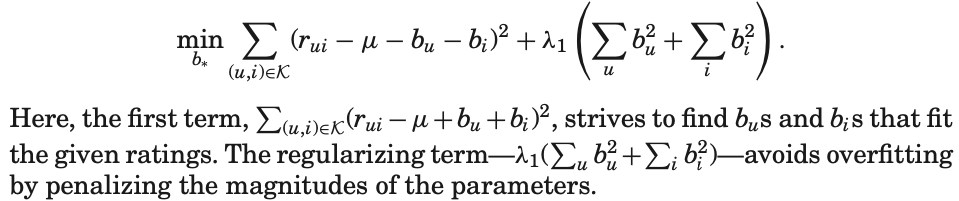
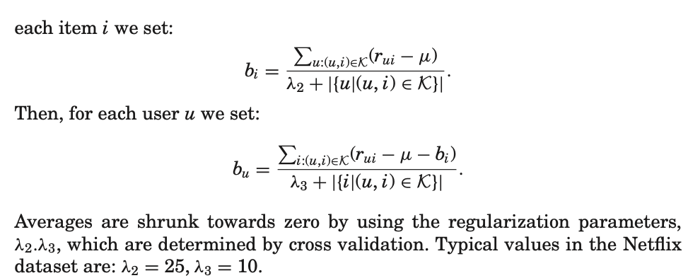
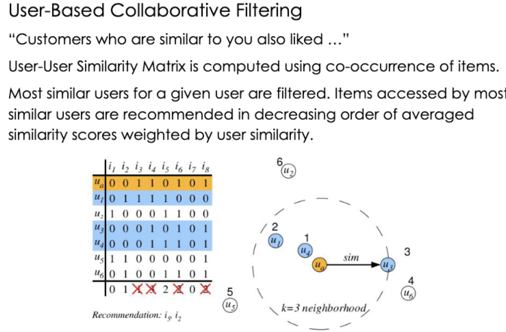
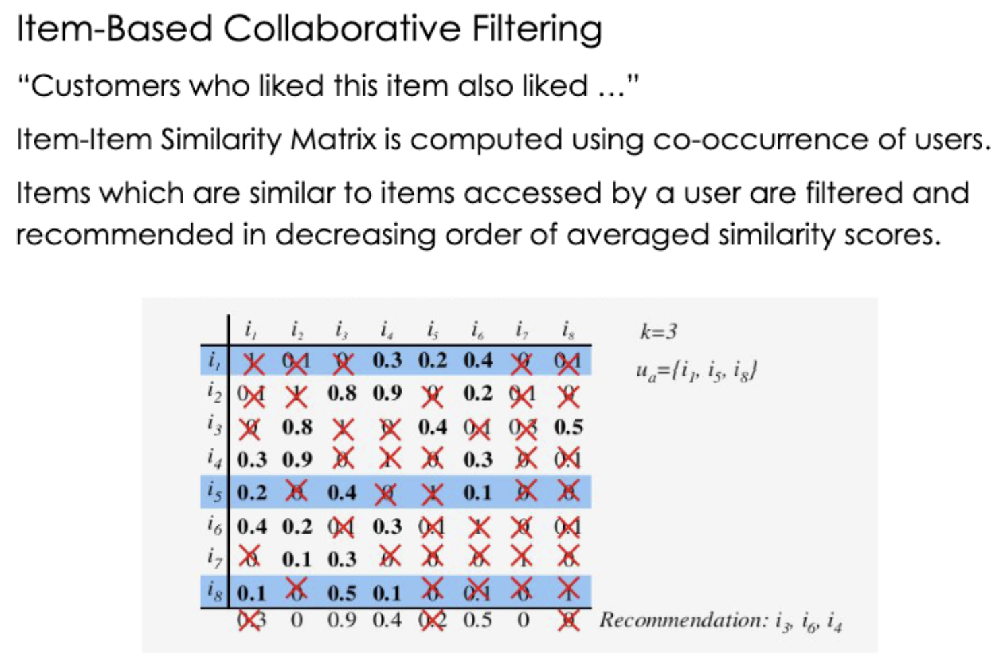
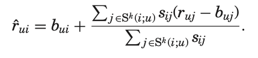
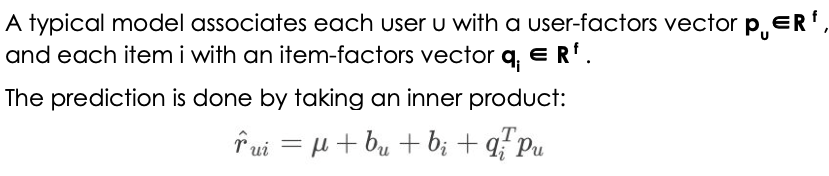
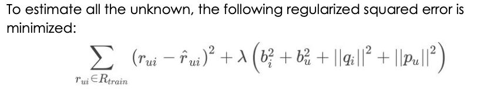
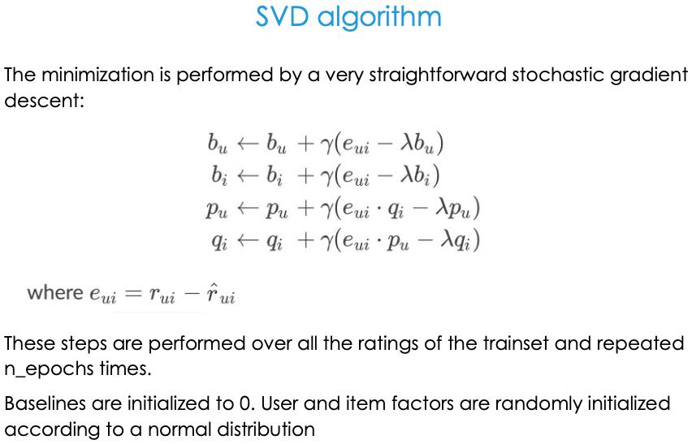
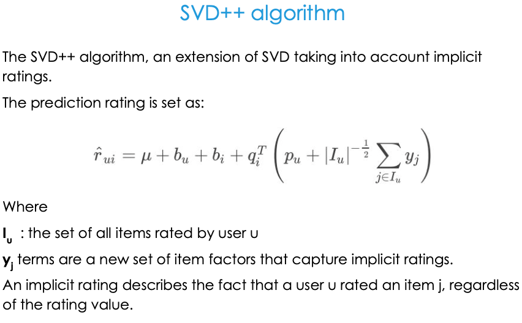

Recommendation Engines are a subclass of information filtering system that seek to predict the item preference for an user.
The objective of a [Recommender System](https://en.wikipedia.org/wiki/Recommender_system) is to recommend relevant items for users, based on their preference. Preference and relevance are subjective, and they are generally inferred by items users have consumed previously.

- Recommender systems are often based on Collaborative Filtering (CF), which relies only on past user behavior—e.g., their previous transactions or product ratings and does not require the creation of explicit profiles.
    - Notably, CF techniques require no domain knowledge and avoid the need for extensive data collection.
    - In addition, relying directly on user behavior allows uncovering complex and unexpected patterns that would be difficult or impossible to profile using known data attributes.
    - In order to establish recommendations, **CF systems need to compare fundamentally different objects: items against users.** There are two primary approaches to facilitate such a comparison, which constitute the two main disciplines of CF: the neighborhood approach and latent factor models.
        - Neighborhood methods are centered on computing the relationships/similarities between items or, alternatively, between users. An item oriented approach evaluates the preference of a user to an item based on ratings of similar items by the same user. In a sense, these methods **transform users to the item space by viewing them as baskets of rated items**. This way, we no longer need to compare users to items, but rather directly relate items to items.
            - Neighborhood models are most effective at detecting very localized relationships. They rely on a few significant neighborhood relations, often ignoring the vast majority of ratings by a user. Consequently, these methods are unable to capture the totality of weak signals encompassed in all of a user’s ratings.
        - Latent factor models, such as pLSA, NeuralNetworks, LDA, Singular Value Decomposition (SVD), comprise an alternative approach to CF by **transforming both items and users to the same latent factor space**, thus making them directly comparable, with the holistic goal to un- cover latent features that explain observed ratings.
            - The latent space tries to explain ratings by characterizing both products and users on latent factors automatically inferred from user feedback.
                - For example, when the products are movies, latent factors might measure obvious dimensions such as comedy vs. drama, amount of action, or orientation to children; less well defined dimensions such as depth of character development or quirkiness; or completely uninterpretable dimensions.
                - For users, each latent factor measures how much the user likes movies that score high on the corresponding movie factor.
            - Latent factor models are generally effective at estimating overall structure that relates simultaneously to most or all items. However, these models are poor at detecting strong associations among a small set of closely related items, precisely where neighborhood models do best.
            - Latent factor models offer **highly expressive** ability to describe various aspects of the data. Thus they tend to provide more accurate results than neighborhood models.
            - However, Latent factor models such as SVD face real **difficulties when needed to explain predictions**. After all, a key to these models is abstracting users via an intermediate layer of user factors. This intermediate layer separates the computed predictions from past user actions and complicates explanations.
            - Similarly, reflecting new ratings requires **relearning the user factors**, and cannot be done as in the neighborhood models, at virtually no cost.
        - The prevalence of neighborhood models is partly thanks to their relative simplicity and intuitiveness. However, there are more important reasons for real life systems to stick with those less accurate models.
            - First, they naturally provide **intuitive explanations of the reasoning behind recommendations**, which often enhance user experience beyond what improved accuracy might achieve.
            - Second, they can **immediately provide recommendations** based on just entered user feedback. i.e handle new ratings without requiring retraining.

- Typical CF data exhibit **large user and item effects** – i.e., systematic tendencies for some users to give higher ratings than others, and for some items to receive higher ratings than others. It is customary to adjust the data by accounting for these effects, which is encapsulated within the baseline estimates. Denote by μ the overall average rating. A baseline estimate for an unknown rating rui is denoted by bui and accounts for the user and item effects:
    `bui = μ + bu + bi`
    - The parameters bu and bi indicate the observed deviations of user u and item i, respectively, from the average.
    - For example, suppose that we want a baseline estimate for the rating of the movie Titanic by user Joe. Now, say that the average rating over all movies, μ, is 3.7 stars. Furthermore, Titanic is better than an average movie, so it tends to be rated 0.5 stars above the average. On the other hand, Joe is a critical user, who tends to rate 0.3 stars lower than the average. Thus, the baseline estimate for Titanic’s rating by Joe would be 3.9 stars by calculating 3.7 − 0.3 + 0.5.
    - Usually the vast majority of ratings are unknown. For example, in the **Netflix data 99% of the possible ratings are missing**. In order to combat **overfitting the sparse rating data**, models are regularized so estimates are shrunk towards baseline defaults. Regularization is controlled by constants which are denoted as: λ1 , λ2 , . . . Exact values of these constants are determined by cross validation. As they grow, regularization becomes heavier.
    - (SGD) In order to estimate bu and bi one can solve the least squares problem
    
        ```
            bsl_options = {'method': 'sgd',
                          'learning_rate': .00005,
                          }
            algo = BaselineOnly(bsl_options=bsl_options)
        ```
    - (ALS) An easier, yet somewhat less accurate way to estimate the parameters is by decoupling the calculation of the bi's from the calculation of the bu's.
    
        ```
            bsl_options = {'method': 'als',
                            'n_epochs': 5,
                            'reg_u': 12,
                            'reg_i': 5
                            }
            algo = BaselineOnly(bsl_options=bsl_options)
        ```

- Recommender systems rely on different types of input.
    - Most convenient is the high quality **explicit feedback**, which includes explicit input by users regarding their interest in products.
        - For example, Netflix collects star ratings for movies and TiVo users indicate their preferences for TV shows by hitting thumbs-up/down buttons.
    - However, explicit feedback is not always available. Thus, recommenders can infer user preferences from the more abundant **implicit feedback**, which indirectly reflect opinion through observing user behavior.
        - Types of implicit feedback include purchase history, browsing history, search patterns, or even mouse movements. For example, a user that purchased many books by the same author probably likes that author.
    - the importance of implicit feedback is that it can illuminate users that did not provide enough explicit feedback. Hence, integrate **explicit and implicit feedback**.

### Families of methods for RecSys:
- [Collaborative Filtering](https://en.wikipedia.org/wiki/Collaborative_filtering): This method makes automatic predictions (filtering) about the interests of a user by collecting preferences or taste information from many users (collaborating). The underlying assumption of the collaborative filtering approach is that if a person A has the same opinion as a person B on a set of items, A is more likely to have B's opinion for a given item than that of a randomly chosen person.
    - There are two types of methods that are commonly used in collaborative filtering:
    - **Model-based** methods, ML techniques are used to learn model parameters within the context of a given optimization framework
    - **Memory-based** methods also referred to as neighborhood-based collaborative filtering algorithms, where ratings of user-item combinations are predicted based on their neighborhoods. These neighborhoods can be further defined as User-Based, and Item Based.

        

        
        
        - The most common approach to CF is based on neighborhood models. Its original form, which was shared by virtually all earlier CF systems, is user-user based
        - User-Based Collaborative Filtering is a technique used to predict the items that a user might like on the basis of ratings given to that item by the other users who have similar tastes with that of the target user. Many websites use collaborative filtering for building their recommendation system.
        - user-user methods estimate unknown ratings based on recorded ratings of **like-minded users.**

        
        
        - Item-Based Collaborative Filtering is the recommendation system to use the similarity between items using the ratings by users.
        - [Item-item collaborative filtering](https://en.wikipedia.org/wiki/Item-item_collaborative_filtering), or item-based, or item-to-item, is a form of collaborative filtering for recommender systems based on the similarity between items calculated using people's ratings of those items.
        - Earlier collaborative filtering systems based on rating similarity between users (known as user-user collaborative filtering) had several problems:
            - systems performed poorly when they had many items but comparatively few ratings
            - computing similarities between all pairs of users was expensive
            - user profiles changed quickly and the entire system model had to be recomputed
        - Item-item models resolve these problems in systems that have more users than items.
        - It uses the most similar items to a user's already-rated items to generate a list of recommendations.
        - the similarities are based on [correlations between the purchases of items by users](https://patents.google.com/patent/US6266649) (e.g., items A and B are similar because a relatively large portion of the users that purchased item A also bought item B).
        - This form of recommendation is analogous to "people who rate item X highly, like you, also tend to rate item Y highly, and you haven't rated item Y yet, so you should try it".
        - Among CF, Item-based CF (IBCF) is a well-known technique that provides accurate recommendations and has been used by Amazon as well.
        - item-item approach estimate unknown rating using known ratings made by the same user on similar items.
        - Better **scalability**(usually lesser no of items than users) and improved accuracy make the item oriented approach more favorable in many cases.
        - Central to most item-item approaches is a **similarity measure** between items.
            - Apart from [cosine](https://surprise.readthedocs.io/en/stable/similarities.html#surprise.similarities.cosine), [mean squared difference-similarity](https://surprise.readthedocs.io/en/stable/similarities.html#surprise.similarities.msd), frequently, it is based on the **[Pearson correlation coefficient : can be seen as a mean-centered cosine similarity](https://surprise.readthedocs.io/en/stable/similarities.html#surprise.similarities.pearson)**, ρij, which measures the tendency of users to rate items i and j similarly.
            - Since many ratings are unknown, it is expected that some items share only a handful of common raters. Computation of the correlation coefficient is based only on the common user support. Accordingly, similarities based on a greater user support are more reliable. An appropriate similarity measure, denoted by sij, would be a **[shrunk correlation coefficient : can be seen as a baseline-centered cosine similarity](https://surprise.readthedocs.io/en/stable/similarities.html#surprise.similarities.pearson_baseline)**
        - [KNNBaseline](https://surprise.readthedocs.io/en/stable/knn_inspired.html#surprise.prediction_algorithms.knns.KNNBaseline) to predict rui — the unobserved rating by user u for item i. Using the similarity measure, we identify the k items rated by u, which are most similar to i. This set of k neighbors is denoted by Sk(i;u). The predicted value of rui is taken as a weighted average of the ratings of neighboring items, while adjusting for user and item effects through the baseline estimates
        
        - More amenable to **explaining** the reasoning behind predictions. This is because users are familiar with items previously preferred by them, but do not know those allegedly like minded users.
            - Users expect a system to give a reason for its predictions, rather than facing “black box” recommendations. This not only enriches the user experience, but also encourages users to interact with the system, fix wrong impressions, and improve long-term accuracy.
            - The neighborhood framework allows identifying which of the past user actions are most influential on the computed prediction.
            - In prediction rule, each past rating (ruj for j ∈ Sk(i;u)) receives a separate term in forming the predicted rˆui, and thus we can isolate its unique contributions. The past ratings associated with highest contributions are identified as the major explanation behind the recommendation.

    - **Latent Factor Models**
        
        - For a given item i, the elements of qi measure the extent to which the item possesses those factors, positive or negative.
        - For a given user u, the elements of pu measure the extent of interest the user has in items that are high on the corresponding factors (again, these may be positive or negative).
        - In information retrieval it is well established to harness SVD for identifying latent semantic factors. Recently, SVD models have gained popularity, thanks to their attractive accuracy and scalability. However, applying SVD in the CF domain raises difficulties due to the high portion of missing ratings. Conventional SVD is undefined when knowledge about the matrix is incomplete.
        - Earlier works relied on **imputation** to fill in missing ratings and make the rating matrix dense. However, imputation can be very expensive as it significantly increases the amount of data. In addition, the data may be considerably distorted due to inaccurate imputation.
        - Moreover, carelessly addressing only the relatively few known entries is highly prone to **overfitting.**
        - Hence, more recent works suggested modeling directly only the observed ratings, while **avoiding overfitting** through an adequate **regularized model**. The reported results compare very favorably with neighborhood models.
        
        - 
        - 


    
    - [if No. of items is greater than No. of users go with user-based collaborative filtering as it will reduce the computation power and If No. of users is greater than No. of items go with item-based collaborative filtering. For Example, Amazon has lakhs of items to sell but has billions of customers.](https://www.analyticsvidhya.com/blog/2021/07/recommendation-system-understanding-the-basic-concepts/). 
        - [Hence Amazon uses item-based collaborative filtering because of less no. of products as compared to its customers.](https://www.cs.umd.edu/~samir/498/Amazon-Recommendations.pdf)

- [Content-Based Filtering](http://recommender-systems.org/content-based-filtering/): This method uses only information about the description and attributes of the items users has previously consumed to model user's preferences. In other words, these algorithms try to recommend items that are similar to those that a user liked in the past (or is examining in the present). In particular, various candidate items are compared with items previously rated by the user and the best-matching items are recommended. Good at finding items that are similar to other items preferred by user, but not so hot at finding something new.
    
    
    - [Content-based methods seem to suffer far less from the cold start problem](https://analyticsindiamag.com/collaborative-filtering-vs-content-based-filtering-for-recommender-systems/) than collaborative approaches because new users or items can be described by their characteristics i.e the content and so relevant suggestions can be done for these new entities. Only new users or items with previously unseen features will logically suffer from this drawback, but once the system is trained enough, this has little to no chance to happen. Basically, it hypothesizes that if a user was interested in an item in the past, they will once again be interested in the same thing in the future. 

- [Collaborative Filtering Vs Content-Based Filtering](https://analyticsindiamag.com/collaborative-filtering-vs-content-based-filtering-for-recommender-systems/) [Paper](https://arxiv.org/pdf/1912.08932.pdf)

- Hybrid methods: Recent research has demonstrated that a hybrid approach, combining collaborative filtering and content-based filtering could be more effective than pure approaches in some cases. These methods can also be used to overcome some of the common problems in recommender systems such as cold start and the sparsity problem.

To know more about state-of-the-art methods published in Recommender Systems on [ACM RecSys conference](https://recsys.acm.org/).


### [Evaluation of Recommender Systems](evaluate_recommenders.md)