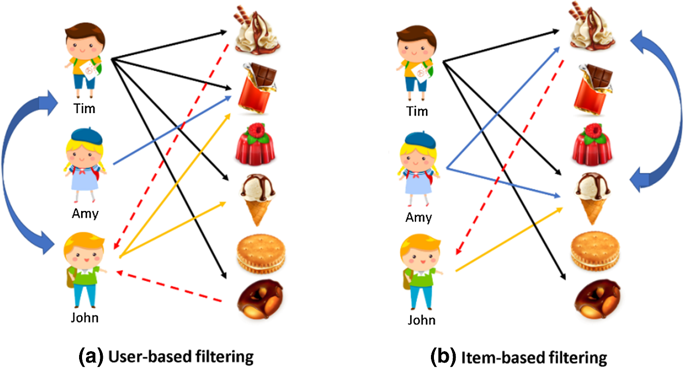
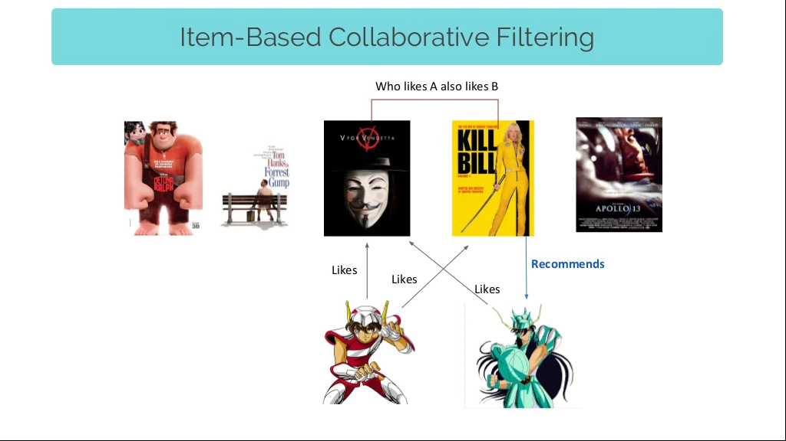
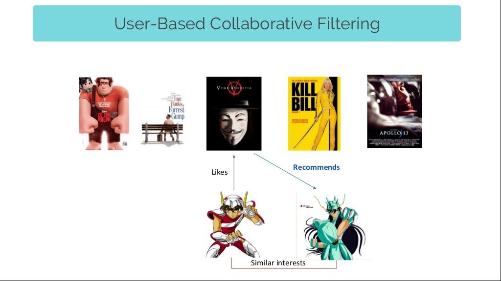
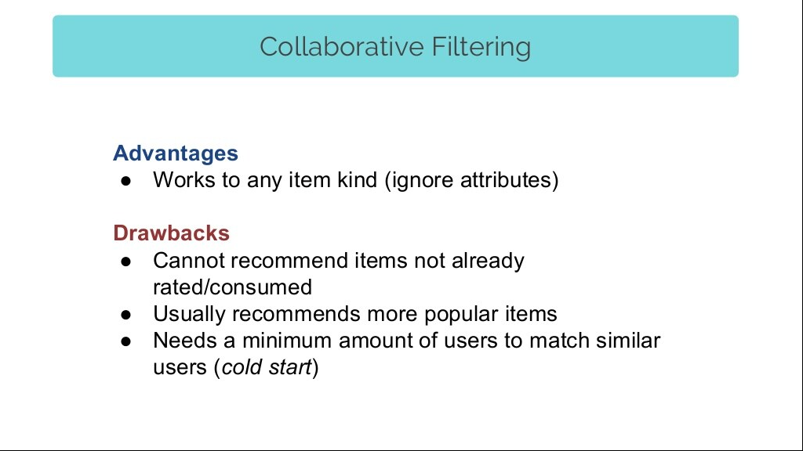
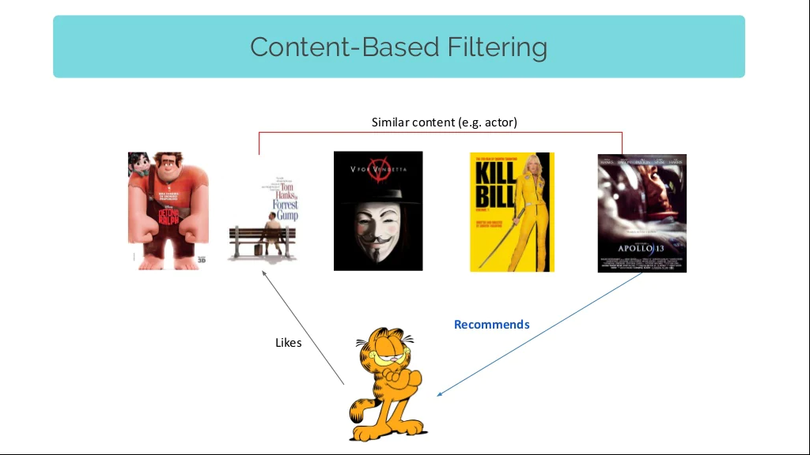
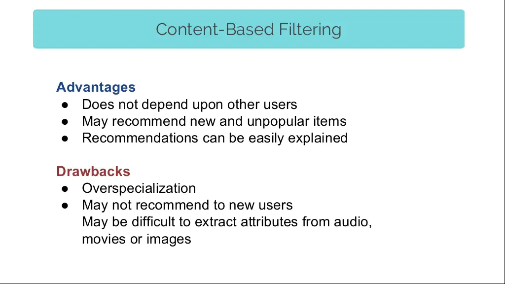

Recommendation Engines are a subclass of information filtering system that seek to predict the item preference for an user.
The objective of a [Recommender System](https://en.wikipedia.org/wiki/Recommender_system) is to recommend relevant items for users, based on their preference. Preference and relevance are subjective, and they are generally inferred by items users have consumed previously.

### Families of methods for RecSys:
- [Collaborative Filtering](https://en.wikipedia.org/wiki/Collaborative_filtering): This method makes automatic predictions (filtering) about the interests of a user by collecting preferences or taste information from many users (collaborating). The underlying assumption of the collaborative filtering approach is that if a person A has the same opinion as a person B on a set of items, A is more likely to have B's opinion for a given item than that of a randomly chosen person.
    - There are two types of methods that are commonly used in collaborative filtering:
    - **Memory-based** methods also referred to as neighborhood-based collaborative filtering algorithms, where ratings of user-item combinations are predicted based on their neighborhoods. These neighborhoods can be further defined as User-Based, and Item Based.

        

        
        - Item-Based Collaborative Filtering is the recommendation system to use the similarity between items using the ratings by users.
            - [Item-item collaborative filtering](https://en.wikipedia.org/wiki/Item-item_collaborative_filtering), or item-based, or item-to-item, is a form of collaborative filtering for recommender systems based on the similarity between items calculated using people's ratings of those items.
            - Earlier collaborative filtering systems based on rating similarity between users (known as user-user collaborative filtering) had several problems:
                - systems performed poorly when they had many items but comparatively few ratings
                - computing similarities between all pairs of users was expensive
                - user profiles changed quickly and the entire system model had to be recomputed
            - Item-item models resolve these problems in systems that have more users than items.
            - It uses the most similar items to a user's already-rated items to generate a list of recommendations. 
            - the similarities are based on [correlations between the purchases of items by users](https://patents.google.com/patent/US6266649) (e.g., items A and B are similar because a relatively large portion of the users that purchased item A also bought item B).
            - This form of recommendation is analogous to "people who rate item X highly, like you, also tend to rate item Y highly, and you haven't rated item Y yet, so you should try it".
            - Among CF, Item-based CF (IBCF) is a well-known technique that provides accurate recommendations and has been used by Amazon as well.

        
        - User-Based Collaborative Filtering is a technique used to predict the items that a user might like on the basis of ratings given to that item by the other users who have similar tastes with that of the target user. Many websites use collaborative filtering for building their recommendation system.

    - In **Model-based** methods, ML techniques are used to learn model parameters within the context of a given optimization framework

    
    - [if No. of items is greater than No. of users go with user-based collaborative filtering as it will reduce the computation power and If No. of users is greater than No. of items go with item-based collaborative filtering. For Example, Amazon has lakhs of items to sell but has billions of customers.](https://www.analyticsvidhya.com/blog/2021/07/recommendation-system-understanding-the-basic-concepts/). 
        - [Hence Amazon uses item-based collaborative filtering because of less no. of products as compared to its customers.](https://www.cs.umd.edu/~samir/498/Amazon-Recommendations.pdf)

- [Content-Based Filtering](http://recommender-systems.org/content-based-filtering/): This method uses only information about the description and attributes of the items users has previously consumed to model user's preferences. In other words, these algorithms try to recommend items that are similar to those that a user liked in the past (or is examining in the present). In particular, various candidate items are compared with items previously rated by the user and the best-matching items are recommended. Good at finding items that are similar to other items preferred by user, but not so hot at finding something new.
    
    
    - [Content-based methods seem to suffer far less from the cold start problem](https://analyticsindiamag.com/collaborative-filtering-vs-content-based-filtering-for-recommender-systems/) than collaborative approaches because new users or items can be described by their characteristics i.e the content and so relevant suggestions can be done for these new entities. Only new users or items with previously unseen features will logically suffer from this drawback, but once the system is trained enough, this has little to no chance to happen. Basically, it hypothesizes that if a user was interested in an item in the past, they will once again be interested in the same thing in the future. 

- [Collaborative Filtering Vs Content-Based Filtering](https://analyticsindiamag.com/collaborative-filtering-vs-content-based-filtering-for-recommender-systems/) [Paper](https://arxiv.org/pdf/1912.08932.pdf)

- Hybrid methods: Recent research has demonstrated that a hybrid approach, combining collaborative filtering and content-based filtering could be more effective than pure approaches in some cases. These methods can also be used to overcome some of the common problems in recommender systems such as cold start and the sparsity problem.

To know more about state-of-the-art methods published in Recommender Systems on [ACM RecSys conference](https://recsys.acm.org/).

### Evaluation

[An Exhaustive List of Methods to Evaluate Recommender Systems](https://towardsdatascience.com/an-exhaustive-list-of-methods-to-evaluate-recommender-systems-a70c05e121de)

[Evaluation Metrics for Recommender Systems](https://towardsdatascience.com/evaluation-metrics-for-recommender-systems-df56c6611093) : python library [recmetrics](https://github.com/statisticianinstilettos/recmetrics)

- MAP, MRR dont require true rating/order of relevant items, just relevant or not is enough

#### Accuracy and Error Based Methods

- Mean Absolute Error (MAE)
    - Mean absolute error is the average of the difference between the rating predicted by the recommender and the actual rating given by the user. So first we compute the error by subtracting predicted rating and actual rating for each user and then we take the mean of all the errors to calculate MAE.
    - We take absolute (as the name suggests) in order to cancel the negative sign, as we are not interested positive or negative score, we only want to know the difference between real and predicted values.
    - Zero MAE means there was no difference between predicted and actual rating and that the model predicted accurately. Therefore, smaller the MAE the better.

- Mean Squared Error (MSE)
    - Mean Squared Error is similar to Mean Absolute Error only difference is that instead of taking absolute of error to cancel the negative sign we square it.
    - MAE helps **penalizes results** so even a small difference will result in a big difference. This also suggests that if MSE is close to zero that means the recommender system really did well because otherwise, the MSE won’t be this small.

- Root Mean Squared Error (RMSE)
    - MSE helps to negate the negative sign but it scales up the errors that cannot be compared to actual rating values due to different rating scales. 
    - In RMSE, we take the square root of MSE to normalize the scale issue that MSE had. This normalizes our mean result on the same scale as it was for rating.

- [RMSE vs MAE](https://towardsdatascience.com/evaluating-recommender-systems-root-means-squared-error-or-mean-absolute-error-1744abc2beac)
    - they’re both on the same scale as the original ratings. However, one may be better to use, depending on the context of the data set.
    - MAE treats outliers and non-outliers equally while RMSE doesn’t. Also, RMSE will almost always be greater than MAE.
    - MAE
        - One large characteristic of Mean Absolute Error(MAE) does not give any bias to extrema(outlier) in error terms. If there are outliers or large error terms, it will weigh those equally to the other predictions. Therefore, MAE should be preferred when looking toward rating accuracy when you’re not really looking toward the importance of outliers. 
    - RMSE
        - One tendency of Root Mean Squared Error is that it tends to **disproportionately penalize large errors** as the residual (error term) is squared. This means RMSE is more prone to being affected by outliers or bad predictions.
        - Additionally, RSME **does not use Absolute Values**, which is a lot more mathematically convenient whenever calculating distance, gradient, or other metrics. That’s why most cost functions in Machine Learning avoid using MAE and rather use sum of squared errors or Root Means Squared Error.
        - The RMSE is more appropriate to represent model performance than the MAE when the error distribution is expected to be Gaussian. However, we do not contend that the RMSE is superior over the MAE. Instead, a [combination of metrics, including but certainly not limited to RMSEs and MAEs](https://www.geosci-model-dev.net/7/1247/2014/gmd-7-1247-2014.pdf), are often required to assess model performance.

- FCP(Fraction of Concordant Pairs)
    - Computed as described in paper [Collaborative Filtering on Ordinal User Feedback](http://www.ijcai.org/Proceedings/13/Papers/449.pdf) by Koren and Sill, section 5.2.

- Data sets for Recommender Systems often have few items that contain the most ratings, whereas most of the items have very few ratings. This affects accuracy measurements as the **accuracy predictions will generally be different on the popular items than the sparsely rated items**. A solution to this problem is to **give item specific weights** toward each of the items when computing RMSE or MAE, which are decided by the merchant. These could allow for a more accurate representation of how the Recommender System is evaluating all of the items.

#### Decision Support Methods

- Decision support metrics helps to understand how much the recommender was useful in **assisting users to take better decision by choosing good items and avoiding bad items**. Two of the most commonly used metrics are precision and recall.
    - Precision is the number of selected items that are relevant.
    - The recall is the number of relevant items that are selected.

    https://medium.com/qloo/popular-evaluation-metrics-in-recommender-systems-explained-324ff2fb427d
    - In the context of recommender systems, we use metrics like recall@k and precision@k, since it is more common to provide k recommendations per example/user. An example can be a user query in our case. I.e., if a user likes a particular set of movies (the query), the output will be a list of k movies (of their potential interest)
        - Recall@k is defined as the percentage of true labels captured when we recommend k labels per example/user
        - Precision@k is defined as the percentage of predictions we get right. 
        - Assume an example has three true labels and the algorithm gives 5 recommendations. If two of these recommendations correspond to true labels, then # of true labels captured = 2, # of true labels = 3 and # of predictions made = 5. Therefore, recall@k = 2/3 = 0.67, precision@k = 2/5 = 0.4. 
        - There is usually an inverse relationship between recall and precision. In addition, there’s a monotonic relationship between recall@k and k (the number of recommendations per example), while precision@k tends to lower with k. i.e As a rule of thumb, recall@k goes up and precision@k goes down with k.

    - F1 score takes values between 0 and 1 just like recall and precision. It becomes 0 when one of precision or recall is 0 and 1 when both precision and recall are 1.
        - In fact, you can set more weight on one of recall or precision depending on which is more important for the task at hand. For this, you can use the generalized version of F score, called Fᵦ score.

    - Average precision@k
        - The metrics of precision@k and recall@k are very good in identifying whether our recommendations are relevant, but not very good at telling us how early or late in the recommendation list they appeared. In other words, **they don’t tell us anything about the rank of the recommendations.**
            - For example, if we provide two lists with 20 recommendations each, where in the first one the top two recommendations are relevant, while in the second list the last two recommendations are relevant both of these lists will result in exactly the same recall@k and precision@k! Obviously, the first list is much more useful and actionable than the latter.
        - Average precision@k takes into account the ranking of the recommendations as well. If we were to give a definition, average precision@k is the average of all precisions in the places where a recommendation becomes relevant (or in other words, where a recommendation is a true positive).

    - [Mean Average Precision (MAP)](http://sdsawtelle.github.io/blog/output/mean-average-precision-MAP-for-recommender-systems.html)
        - MAP is very popular evaluation metric for algorithms that do information retrieval like google search results, but it also can apply to user-targeted product recommendations. If you have an algorithm that is returning a ranked ordering of items, each item is either hit or miss (like relevant vs. irrelevant search results) and items further down in the list are less likely to be used/seen (like search results at the bottom of the page), then MAP might be a useful metric.
        - Using MAP to evaluate a recommender algorithm implies that you are treating the recommendation like a ranking task. This often makes perfect sense since a user has a finite amount of time and attention and we want to show the top recommendations first and maybe market them more aggressively.
        - In recommendation systems MAP computes the mean of the Average Precision (AP) over all your users. The AP is a measure that takes in a ranked list of your N recommendations and compares it to a list of the true set of "correct" or "relevant" recommendations for that user. AP rewards you for having a lot of "correct" (relevant) recommendations in your list, and rewards you for putting the most likely correct recommendations at the top (you are penalized more when incorrect guesses are higher up in the ranking). So order of "hits" and "misses" matters a lot in computing an AP score, but once you have front-loaded your best guesses you can never decrease your AP by adding on more.

    - ROC Curve
        - changing the number of items to recommend will change how many correct and incorrect items our list has.
        - How to determine the best threshold of numbers of items to recommend that can get maximum relevant items and minimum irrelevant items? ROC curve can help us answer just that.

#### Ranking Based Methods

- Methods we touched so far allow us to understand the overall performance of the results we get from the recommender systems. But they provide no information on how the items were ordered. 
- A model can have a good RMSE score but if the top three items that it recommends are not relevant to the user then the recommendation is not much useful.
- Ranking based evaluation methods assist us in understanding how suggested items are ordered in terms of their relevancy for the users. They help us to measure quality items ranking.

    - [nDCG](https://towardsdatascience.com/an-exhaustive-list-of-methods-to-evaluate-recommender-systems-a70c05e121de)
        - nDCG has three parts. First is ‘CG’ which stands for Cumulative Gains. It deals with the fact that most relevant items are more useful than somewhat relevant items that are more useful than irrelevant items (Most relevant items >> Somewhat relevant items >> Irrelevant items)
        - It sums the **items based on its relevancy**, hence, the term cumulative. Suppose we are asked to score the items based on their relevancy as
        Most relevant score => 2
        Somewhat relevant score => 1
        Least relevant score => 0
        If we are to sum these score we will get cumulative gain for the given items.
        - But CG doesn’t **account for the position of the items** on the list. And hence, changing the item's position won’t change the CG. This is where the second part of nDCG comes in to play i.e. ‘D’.
        - Discounted Cumulative Gain, DCG for short, penalized the relevant items that appear lower in the list. A relevant item appearing at the end of the list is a result of a bad recommender system and hence that **item should be discounted to indicate the bad performance of the model**. To do so we divide the relevance score of items with the log of its rank on the list.
        - DCG helps with the ranking but suppose we are comparing the different lists of the recommender. DCG for each of the list will be different depending upon where the recommender places the items. What will be DCG for when the most relevant item was placed at 10th position on 20 items list of recommender verses DCG for when the somewhat relevant item was paced at 10th position on 11th item list. To normalize this ’n’ of nDCG, the third part, comes in to play.
        - nDCG normalized the DCG values of the different number of the items lists. To do so we sort the item list by relevancy and calculate the DCG for that list. This will be the perfect DCG score as items are sorted by their relevancy score. We divide all DCG score of all the list we get by this perfect DCG to get the normalized score for that list.
        - [Wiki DCG](https://en.wikipedia.org/wiki/Discounted_cumulative_gain)
            - DCG measures the usefulness, or gain, of a document based on its position in the result list. The gain is accumulated from the top of the result list to the bottom, with the gain of each result discounted at lower ranks
            - Cumulative Gain (CG) is the sum of the graded relevance values of all results in a search result list. This predecessor of DCG does not include the rank (position) of a result in the result list into the consideration of the usefulness of a result set
            - The premise of DCG is that highly relevant documents appearing lower in a search result list should be penalized as the graded relevance value is reduced logarithmically proportional to the position of the result.
            - Search result lists vary in length depending on the query. Comparing a search engine's performance from one query to the next cannot be consistently achieved using DCG alone, so the cumulative gain at each position for a chosen value of {\displaystyle p}p should be normalized across queries. This is done by sorting all relevant documents in the corpus by their relative relevance, producing the maximum possible DCG through position p, also called Ideal DCG (IDCG) through that position. 
            - Normalized DCG metric does not penalize for bad documents in the result

    - MRR Mean reciprocal Rank, MRR for short, focuses on where is the **first relevant item in the recommended list**.
        - MRR for a list with the first relevant item at its third position will be greater than for a list with the first relevant item at 4th position.
        - MRR takes the reciprocal of the relevant items’ position and sums them.

    - [Spearman rank correlation](https://statistics.laerd.com/statistical-guides/spearmans-rank-order-correlation-statistical-guide.php) computes the score of how model ranked the items compared to how they should be ranked.
        - Spearman rank correlation ranges between 1 and -1 with negative sign indicates that items are ranked in the opposite direction.

#### Other Method (Coverage, Popularity, Novelty, Diversity, Temporal Evaluation)

- assess questions such as the number of items model is suggesting out of total item base. Or If the model recommends something out of unusual or it only recommending items similar to the user’s past history.

- Coverage : Coverage helps to measure the number of items the recommender was able to suggest out of a total item base. 
    - Suppose we have 1000 products and the model covers 800 of those items to the different users then it means that coverage of our recommender is 80% which is not bad. Coverage can be further broken down into the type of item. Percentage of populate items vs nonpopular items the model was able to suggest. 
    - If the goal is to suggest the maximum number of items to the user then coverage can be a very helpful tool to assess the recommender model.

- Popularity
    - It is normal for some items to dominate user preferences. These are popular items. And it is equally normal for a recommender to also mostly suggest popular items. And it is neither a bad thing.
    - It is up to us if we want our model to suggest popular items or we want recommender to suggest non-popular items. The popularity metric helps us evaluate just that. Able to understand how much of our recommender is suggesting such items can help us decide if we should move forward with the model or not.

- Novelty
    - In some domains, such as in music recommender, it is okay if the model is suggesting similar items to the user. But even then suggesting similar items again and again can lead to bad user experience as users may want to explore new and something different. 
    - Novelty helps to understand such behavior of the model. Do our recommender model has the capability to recommend items out of the blue?. 
    - The novelty might not be useful where you are recommending items to a user on checkouts as users will be more interested in similar items that they purchased. But a place where the user is still exploring the website suggesting something completely new and different can be useful and novelty helps measure that.

- Diversity
    - Similar to novelty, depending upon the domain and where we are to recommend items understanding our model's diversity is also useful. Measuring how diverse our model’s suggestion is can be very useful. As high diversity means that our users will always have something different and diverse to view and consume. So for the domain where we always want to show something new diversity is the metric to go for.

- Temporal Evaluation
    - People taste changes with time. You might rate a movie 10 out of 10 when you watched it but after two-three years your rating might drop to 8 or event 6. This could be due to your taste may have changed or you got mature, or you are a completely different person now than you were back then when you gave the movie 10 stars. There are many factors that could change your likeness towards something. 
    - Considering temporal effects on an item can also help us built and evaluate the model. The winner of Netflix competition also had a temporal element in their model. Consider every rating that the user gave vs only taking into account the ratings that the user recently gave can have a substantial impact on our model’s ability to predict what user may like at that point in time. 

#### Business Metrics

- Apart from measuring the prediction power of the recommendation system, it is very much important, or even more, to measure how the **model is performing to achieve the business objective**
- Any model how sophisticated it maybe is built to help support business right?. Measuring the business metrics for which the model was built should be the end goal
    - If the model is to increase revenue and if revenue increases after integrating the recommendation system then that is a good recommender system for your business.
    - If the model is targeted to improve the in-app experience and if you see daily active user increases then your model performed exactly why it was built.
    - Improving email campaigns, increase retention rate, increasing in-app engagement, If a model delivers for what it was built then it is a good recommender system otherwise you should re-built and re-evaluate it.